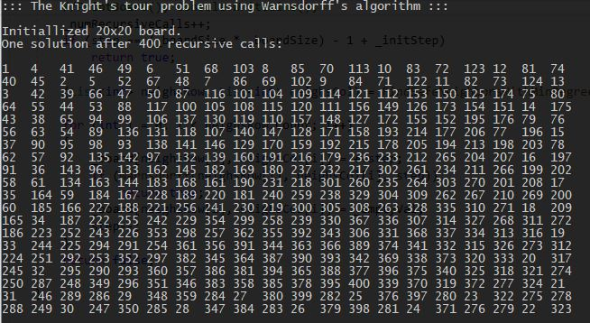

# CA.Warnsdorff.KnightTour
Solves [Knight's Tour combinatorial problem](https://en.wikipedia.org/wiki/Knight%27s_tour) using Warnsdorff's heuristic algorithm.
This allows to find a solution in larger boards in practical time.

The mechanic is simple.
The knight is moved so that it always proceeds to the square from which the knight will have the fewest onward moves.
In a graph analogy, jump to the next neighbor node with the smaller degree.

## Example

